```{r include = FALSE}
source("../tools/chunk-options.R")
```

# Playing with code

<!--sec data-title="Learning Objectives" data-id="obj" data-show=true data-collapse=false ces-->

* to put the programming concepts from the previous sections into use
* to learn to use Scratch

<!--endsec-->

<br>

---

**Table of Contents**

<!-- toc -->

<br>

---

## Introduction to Scratch

Now you get to use your new programming knowledge! Scratch is a programming language that lets you create interactive stories. The code is presented in blocks so you can choose the code that you want and drag it onto the screen. To use Scratch all you need is an internet browser (e.g. Chrome, Firefox).

In your internet browser, open the following link: [https://scratch.mit.edu.au](https://scratch.mit.edu.au). Click on Create in the menu at the top of the screen. This should take you to a page that looks like:

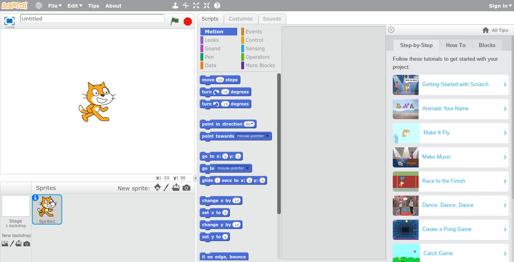

The top-left panel is the animation screen, which currently contains the image of a cat. This cat is called a sprite. You can create a new sprite by clicking on the icons below the animation pane on the right. You can add a background to the scene by clicking on the icons below the text 'add backdrop', which appears on the left below the animation pane.

In order to animate an object, click on the image of that object below the animation pane. The animation options are available in the centre of the screen. Along the top are the menus: Scripts, Costumes and Sounds. Scripts contains all the code that can be used to animate your scene. Costumes contains the costumes that your sprite can change into (e.g. when walking you may want your sprite to change between having his right leg forward and having his left leg forward). 

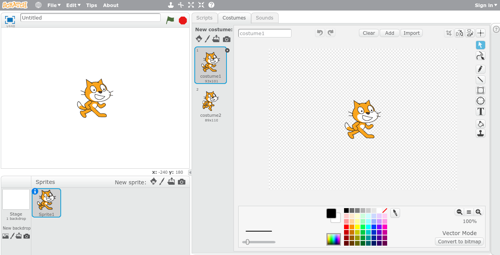

Sounds contains the sounds that your sprite can make. Click on the play button to hear the cat meow.

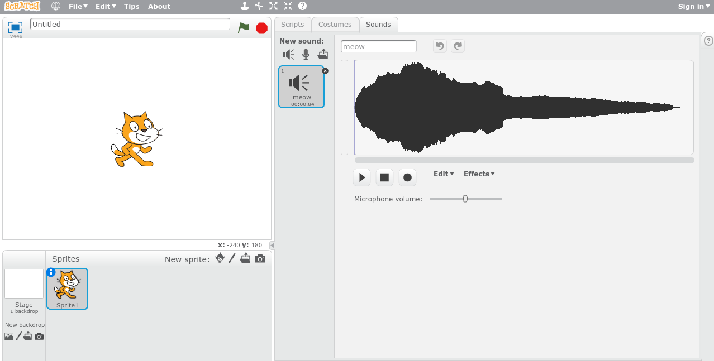

<br>

---


## Move a sprite

To make the sprite move, in the Scripts panel, select the block that says 'move 10 steps' (this is in the motion submenu). Drag this block of code onto the panel on the right hand side of the screen. Change the 10 to 100. When you click on this block of code your sprite should move to the right.

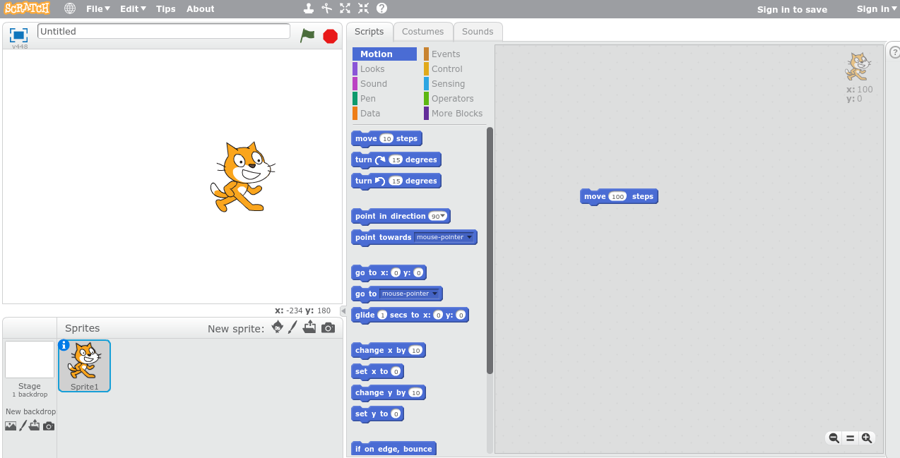

<br>

---


## Add a sound

Let's make the cat when he moves. In the Scripts panel, click on the Sound submenu. Select the block that says 'play sound meow' and drag it onto the animation pane. Place the block of code below the code used to move the sprite. They should click together. When you click on the code block, the sprite should move to the right and meow.

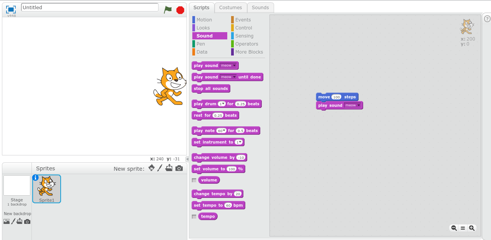

<br>

---


## Move backwards

By now your sprite is probably near the edge of the animation pane. Click on him and drag him back to the centre of the screen. After waiting a short period of time we want our sprite to move back to his start position. Under the control submenu choose the block 'wait 1 secs'. Drag this onto the code pane and click it in under the current code blocks. Change 1 to 0.5.

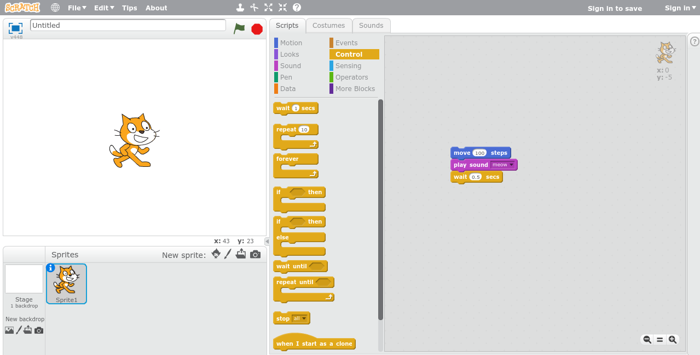

From the Motion submenu select 'move 10 steps' and add this to the code. Change 10 to -100 (this will make the sprite move 100 steps to the left). From the Sound submenu select 'play drum 1 for 0.25 beats'. You can change this to whichever drum sound you would like by using the drop down menu. The below example uses the Crash Cymbal (4). Then add another 'wait 1 secs' from the Control submenu. Again, change the 1 to 0.5. 

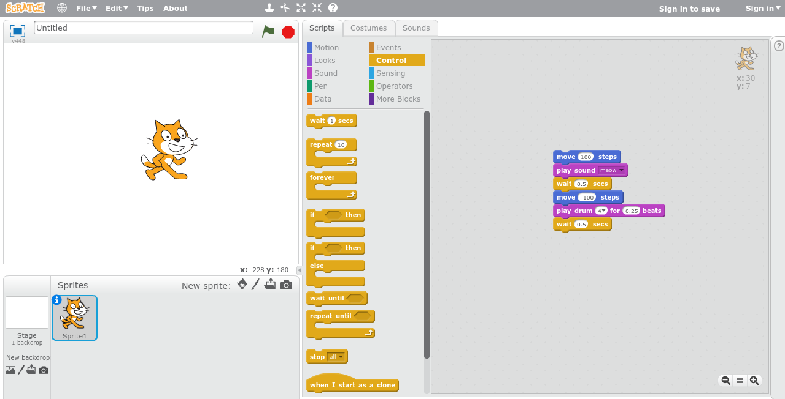

When you click on the code block, your sprite should meow and move to the right and then a drum should sound while the sprite moves to the left.

<br>

---


## Repeat instructions

Now let's make our sprite repeat the back and forth motion several times. From the Control submenu, select 'repeat 10'. Drag this block of code onto the coding pane and use it to envelop the code blocks already there.

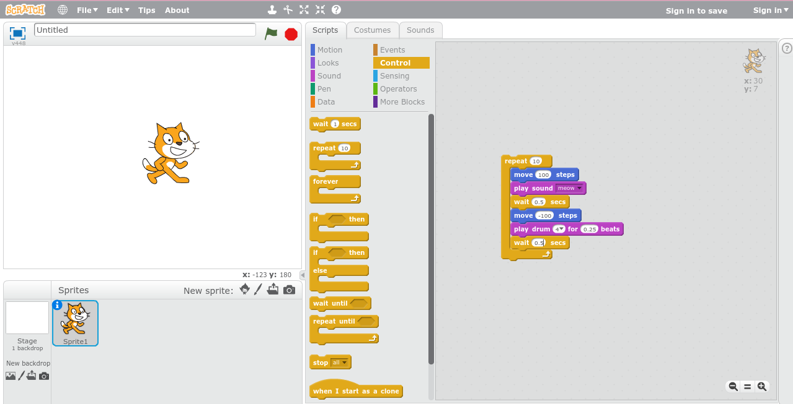

When you click on the blocks of code, your sprite should now repeat the back and forth motion 10 times. You have just made your first loop!

<br>

---


## Add speech

After the back and forth motion, let's make the sprite say 'Yo!'. From the Looks submenu select 'say Hello! for 2 secs' and add this below the repeat in the code pane. Change Hello! to Yo!.

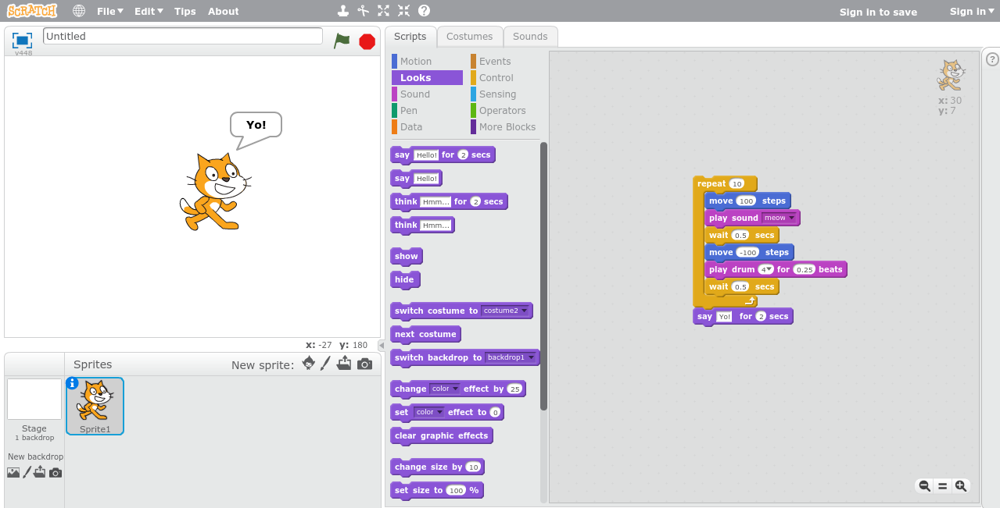

<br>

---


## Add an event

If you make many sprites, it will be difficult to have them doing many things at the same time if you need to click on each section of code to run it. Instead, we can add an event that triggers the code to run. An event may be a key press, a mouse click or clicking the green flag at the top of the animation pane. Let's set the code to start running each time the green flag is clicked.

From the Events submenu select 'when green flag clicked'. Add this above the current code in the coding pane. Now click the green flag above the animation pane and see what happens!

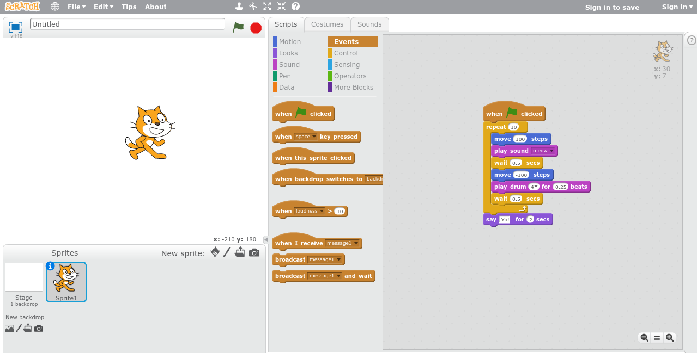

<br>

---


## Changing colours

Let's add a colour change to our sprite each time the space bar is pressed. From the Events submenu select 'when space key pressed'. From the looks submenu select 'change color effect by 25' and add this to the key press event. What happens when you press the space bar?

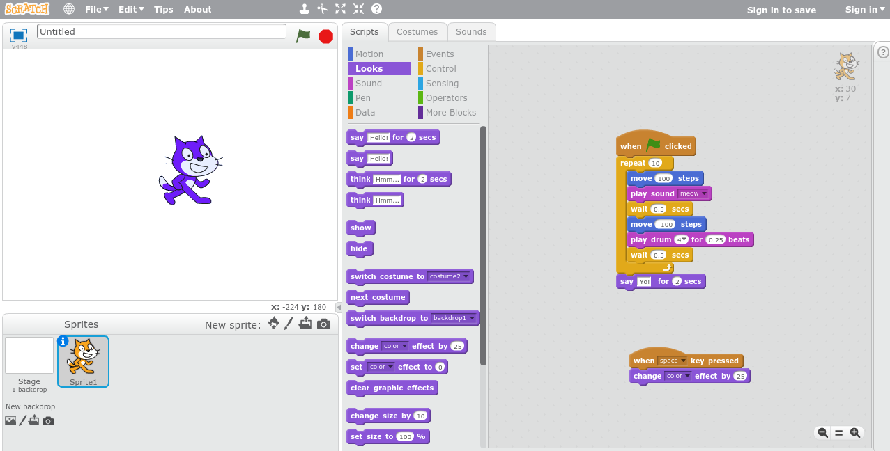

<br>

<!--sec data-title="Challenge" data-id="ch" data-show=true data-collapse=false ces-->

You now have the skills to make an animation. What animation will you create?

<!--endsec-->

<br>

<!--sec data-title="Tip: Saving your animation" data-id="tip1" data-show=true data-collapse=true ces-->

To save your animation, select 'Download to your computer' from the File drop-down menu. To re-open a saved animation, navigate to the Scratch website and select 'Upload from your computer' from the File drop-down menu. **Note:** You will not be able to view the animation by double clicking on the file.

<!--endsec-->
