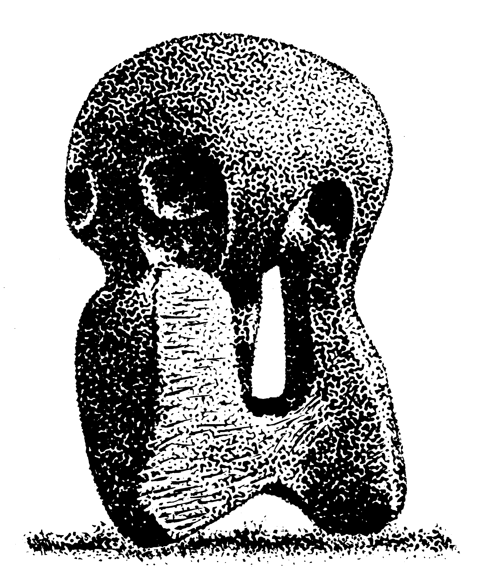

```{r include = FALSE}
source("../tools/chunk-options.R")
```

# Variables

<!--sec data-title="Learning Objectives" data-id="obj" data-show=true data-collapse=false ces-->

* to understand the need to name objects in programming
* to be comfortable with the term 'variable'

<!--endsec-->

<br>

---

**Table of Contents**

<!-- toc -->

<br>

---

## Naming variables

The first thing to realise about programming is: if you want the computer to remember something, you need to give it a name. Otherwise, your computer is just acting as a glorified calculator. If you type `1 + 1`, the computer will return `2`. But if you didn’t give it a name, then as soon as the computer has calculated the answer for you, it has already forgotten about it. 

This is like talking to someone with amnesia... 
> You: ‘Meet my friend, Fred’

> Computer: 'Hi Fred!'

> You: 'What is my friend's name?'

> Computer: 'What friend?'

<br>

<!--sec data-title="Challenge 1" data-id="ch1" data-show=true data-collapse=false ces-->

Let’s have a go at naming things! 

A. What would you name this abstract object?
<figure align="middle">
  
</figure>

B. Give this baby a name
<figure align="middle">
  
</figure>

<!--endsec-->

<br>

By giving these images a name, you have made them into **variables**. You can remember these variables by their names and refer to them later. In the same way, if you name things when programming, your computer can store them in memory and access them later by that name. 

We can change the contents of a variable, but the name will stay the same. Much like how the baby pictured in Challenge 1 will look different as she grows up, but (unless she goes through legal channels to change it) her name will always stay the same.

<br>

---

## Don't refer to a variable before it has been named

It’s important that you don't start using names before you introduce your computer to them. Much like if a friend started talking to you about flickledutts: 
> “Flickledutts is awesome, don’t you think so?”

You would probably be wondering what it is that they're talking about and whether you need to call for some psychiatric backup. However, if your friend prefaced their question with a description of this new game that they've just discovered called flickledutts, you would be more likely to roll your eyes and wait out the enthusiastic tirade.

<br>

---

## A coding example

Here are a couple of example of creating variables in R. The name of the variable is on the left and the value of the variable on the right. The left arrow means assign the value on the right to the variable name on the left. This first line of code says: create a variable called baby and assign it the value 'Meredith'.

```{r}
baby <- 'Meredith'
```

The second line of code says: create a variable called sculpture and assign it the value 10.

```{r}
sculpture <- 10
```

These variables are now stored in the computer's memory and can be referred to later.

<!--sec data-title="Take home messages" data-id="takehome" data-show=true data-collapse=false ces-->

* We create variables that the computer can store in its memory by giving them names 
* We need to define these variables before referring to them in our code

<!--endsec-->
